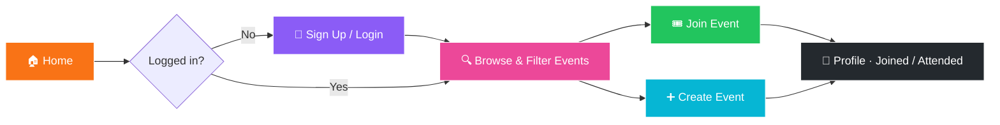

<!-- ═══════════════ ANIMATED HERO ═══════════════ -->
<div align="center">

<!-- Layer 1: aurora wave header -->


<!-- Layer 2: custom animated SVG banner (assets/banner.svg) -->


<!-- Layer 3: typing animation -->
<a href="https://localoom.netlify.app/">
  
</a>

<br/><br/>

<a href="https://localoom.netlify.app/"></a>


<br/><br/>

<!-- Live repo stats (replace YOUR_USERNAME/YOUR_REPO) -->


<br/><br/>

**[✨ Features](#-features)** &nbsp;•&nbsp; **[🗂 Categories](#-event-categories)** &nbsp;•&nbsp; **[🧭 User Flow](#-user-flow)** &nbsp;•&nbsp; **[🛠 Tech Stack](#-tech-stack)** &nbsp;•&nbsp; **[⚡ Quick Start](#-quick-start)** &nbsp;•&nbsp; **[🗺 Roadmap](#-roadmap)**

</div>


## 📖 About

**LocaLoom** weaves your city together. It's a community platform where people in **Delhi** can find, join and create local events — from sunrise heritage walks to street-food trails, fitness meetups, workshops and volunteering drives — all happening right in their neighbourhood.

> 🧵 *Loom* (n.) — a device that weaves threads into fabric. LocaLoom weaves **locals** into a community.

<div align="center">

| 🔍 **Discover** | 🎟 **Join** | ➕ **Create** |
|:---:|:---:|:---:|
| Browse events by category and location | Reserve your spot in one tap | Host your own event for free or paid |

</div>


## ✨ Features

| | Feature | Details |
|:---:|:---|:---|
| 🏠 | **Event Feed** | Upcoming events at a glance with an *Explore Events* call-to-action |
| 🗂 | **Category Filters** | Filter instantly: Heritage, Food, Fitness, Learn, Volunteer, Social |
| 📍 | **Event Locations** | See events near you on a location view |
| ➕ | **Create Event** | Title, description, category, organizer, date, time, location, price (₹) & max attendees |
| 💸 | **Free or Paid** | Enter `0` for free events — pricing in Indian Rupees |
| 🔐 | **Auth** | Sign up / sign in with email and password |
| 👤 | **Profile** | Track events joined, created and attended |
| 📱 | **Responsive** | Built to work on desktop and mobile |


## 🗂 Event Categories

<div align="center">


</div>


## 🧭 User Flow




## 🛠 Tech Stack

<div align="center">


</div>

<!-- ✏️ Update this table to match your real stack (React, Vite, Tailwind, etc.) -->

| Layer | Technology |
|:---:|:---|
| 🎨 **Frontend** | HTML · CSS · JavaScript |
| ☁️ **Hosting** | [Netlify](https://www.netlify.com/) |
| 🧰 **Tooling** | Git · GitHub · VS Code |


## ⚡ Quick Start

```bash
# 1️⃣ Clone the repository
git clone https://github.com/YOUR_USERNAME/YOUR_REPO.git

# 2️⃣ Move into the project
cd YOUR_REPO

# 3️⃣ Serve it locally (static site)
npx serve .
```

🎉 Open the URL shown in your terminal and you're live!

<details>
<summary><b>📦 Using a framework (npm / Vite)?</b></summary>
<br/>

```bash
npm install
npm run dev
```

</details>


## 🚀 Deployment

Deployed on **Netlify** — every push to the main branch can trigger an automatic redeploy.

[](https://localoom.netlify.app/)


## 🗺 Roadmap

- [x] Event feed with category filters
- [x] Create event form
- [x] Login & sign-up screens
- [x] User profile with event stats
- [ ] 🗺 Interactive map of nearby events
- [ ] 🔔 Event reminders & notifications
- [ ] 💳 Online payments for paid events
- [ ] 💬 Event chat & comments
- [ ] 🌍 Expand beyond Delhi


## 🤝 Contributing

Contributions, issues and feature requests are welcome!

1. 🍴 Fork the repo
2. 🌿 Create a branch: `git checkout -b feature/amazing-feature`
3. 💾 Commit: `git commit -m "Add amazing feature"`
4. 📤 Push: `git push origin feature/amazing-feature`
5. 🔃 Open a Pull Request

<!-- ═══════════════ ANIMATED FOOTER ═══════════════ -->
<div align="center">

<br/>


</div>
